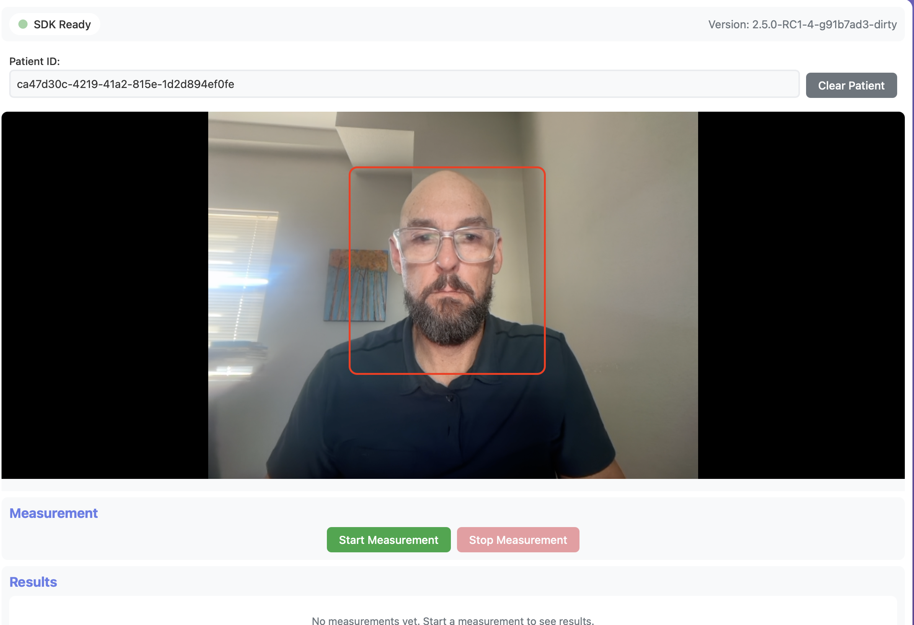

# Vitals Web SDK - Vanilla JavaScript Example

A complete working example demonstrating integration of the Vitals Web SDK with a Node.js/Express backend.

## Quick Start

```bash
# Install dependencies
npm install

# Configure environment
cp .env.example .env
# Edit .env with your Mindset API credentials

# Start server
npm start
```

Then open `http://localhost:3015` in your browser.



Depending on the device used, a user should be positioned approximately 12-18 inches from the camera in the area outlined in this screenshot.


## Setup

### Prerequisites

- Node.js 18+
- Modern browser with camera support (Chrome recommended)
- Mindset API credentials (API key and clinic ID)

### Configuration

Create `.env` file in `examples/vanilla-js/`:

```bash
MINDSET_API_URL=https://api-develop.mindsetmedical.com
MINDSET_API_KEY=your-api-key-here
CLINIC_ID=your-clinic-id-here
PORT=3015
```

## How It Works

This example is the reference implementation for a complete end-to-end flow:

1. **Create Patient** - Creates patient record via Mindset REST API
2. **SDK Initializes** - Camera starts, preview mode begins
3. **Start Measurement** - SDK calls authenticator → server creates notification → returns WASM auth
4. **Measure Vitals** - Follow guidance (face centered, well-lit, still)
5. **Submit Results** - SDK stops → client library sends vitals → server submits to Mindset REST API using clinic API key

### Data Flow

```
Client Library            Server                      Mindset REST API
--------------            ------                      ----------------
createPatient() ────────> POST /patient/create ─────> POST /users/shadow
                                                      ← patient ID

authorize() ───────────> POST /auth ─────────────────> POST /notifications
(with runToken)                                       ← notification + vitals_auth
                         (stores meta.pro_submission_id)

stop() → vitals ───────> POST /patient/vitals ──────> PUT /pro_submissions/{proSubmissionId}
                         (uses clinic API key)        (via PROVIDER_SERVICE scope)
```

**Security:** Client library never sees auth tokens, notification IDs, PRO submission IDs, or the clinic API key. Server handles all authentication using the clinic API key.

**For complete REST API documentation, see [Mindset REST APIs](../../mindset_rest_apis.md).**

## Backend Endpoints

### `POST /patient/create`
Creates a new patient record.

**Response:**
```json
{
  "success": true,
  "patientId": "uuid"
}
```

### `POST /auth`
Authorizes WASM algorithm and creates notification.

**Request:**
```json
{
  "patientId": "uuid",
  "runToken": { "config": "...", "pubKey": "..." }
}
```

**Response:**
```json
{
  "success": true,
  "vitalCoreAuth": { "authToken": "..." }
}
```

**Note:** Server stores `meta.pro_submission_id` internally. Client library never sees it.

### `POST /patient/vitals`
Submits vitals to Mindset REST API PRO system using clinic API key.

**Request:**
```json
{
  "patientId": "uuid",
  "vitals": {
    "vitals": {
      "vitals": {
        "PR_GW": { "hr": 72, "hrConfidence": 95 },
        "RR_GW": { "rr": 16, "rrConfidence": 90 }
      }
    },
    "signsMsgs": { "1234567890": { "dataStatus": ["S-HRT-061"] } },
    "finalVitalsMeasurementValues": {
      "PR_GW": { "hr": 72, "hrConfidence": 95 },
      "RR_GW": { "rr": 16, "rrConfidence": 90 }
    },
    "prevVitals": [],
    "prevSignsMsgs": [],
    "noValidMeasurements": false,
    "webAppVersion": "1.0.0",
    "frameCollectionMethod": "web-sdk",
    "timestamp": 1234567890
  }
}
```

**Response:**
```json
{
  "success": true,
  "data": { /* PRO submission record */ }
}
```

**Note:** SDK provides complete VITAL-TRAC structure ready for submission. Server uses `MINDSET_API_KEY` to submit via `PUT /users/{id}/pro_submissions/{proSubmissionId}` with `PROVIDER_SERVICE` scope, passing the vitals data directly: `{ pro_type: 'VITAL-TRAC', pro_data: { data: vitals, recorded_at: ... } }`. The `proSubmissionId` value is `meta.pro_submission_id` from the authorization response, not the notification `id`.

## SDK Integration

### Basic Setup

```javascript
import { createVitalClient } from '/dist/index.js';

// Authenticator callback
async function authenticateVitalCore(runToken) {
  const response = await fetch('/auth', {
    method: 'POST',
    headers: { 'Content-Type': 'application/json' },
    body: JSON.stringify({ patientId: currentPatientId, runToken })
  });
  const data = await response.json();
  return data.vitalCoreAuth;
}

// Create client
const vitalClient = createVitalClient({
  workerDirectory: '/dist',
  authenticator: authenticateVitalCore
});

// Set up events
vitalClient.on('ready', () => console.log('SDK ready'));
vitalClient.on('authorizedVitals', (vitals) => console.log('Authorized:', vitals));
vitalClient.on('timeLeft', ({ timeLeft, percentComplete }) => {
  updateProgress(percentComplete);
});
vitalClient.on('signsMessage', (msg) => handleWarnings(msg.dataStatus));
vitalClient.on('stop', (result) => displayResults(result));

// Initialize and start
await vitalClient.init();
await vitalClient.startPreviewMode(videoElement);
await vitalClient.authorize();
await vitalClient.start(selectedVitals, videoElement);
```

### Key Events

- `ready` - SDK initialized
- `authorizedVitals` - List of authorized vitals
- `timeLeft` - Progress updates (includes `percentComplete`)
- `signsMessage` - Real-time quality feedback
- `stop` - Measurement complete

### Warning Codes

| Code | Message |
|------|---------|
| `E-FDM-041` | Face not detected |
| `E-DQM-021` | Please stay still |
| `E-DQM-022` | Improve lighting |
| `W-RES-079` | Face too far |
| `W-RES-080` | Face too close |

## Troubleshooting

**Patient creation fails:**
- Check `MINDSET_API_KEY` and `CLINIC_ID` in `.env`

**Camera not working:**
- Use HTTPS or localhost
- Allow camera permissions

**Authorization fails:**
- Verify API credentials
- Check server console for errors
- Ensure clinic has vital core features enabled

**Measurement issues:**
- Call `authorize()` before `start()`
- Ensure face is visible and well-lit
- Check `authorizedVitals` event for available vitals

## Development

```bash
# Start server
npm start

# Changes to public/ files are served immediately
# Refresh browser to see updates
```

## License

UNLICENSED - For demonstration purposes only
